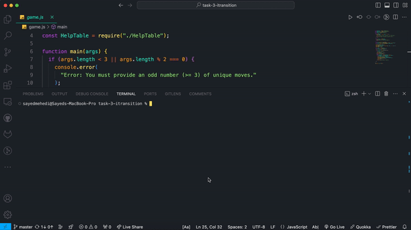

# Generalized Rock-Paper-Scissors Game

This repository contains a JavaScript implementation of a generalized rock-paper-scissors game. The game supports an arbitrary number of moves and uses cryptographic techniques to ensure fair play.

## Features

- Supports any odd number of unique moves (e.g., rock, paper, scissors, lizard, Spock).
- Generates a cryptographically secure random key for each game session.
- Calculates and displays an HMAC to prove that the computer did not change its move after the user made a choice.
- Provides a help table showing win/lose/draw outcomes for each move.
- Allows users to interact via the command line.

## Requirements

- Node.js (version 14 or later)

## Installation

1. **Clone the repository:**

   ```bash
   git git@github.com:iamrakib097/task-3-itransition.git
   cd task-3-itransition


2. **Ensure you have Node.js installed. You can download it from nodejs.org**

## Running the Game
```bash
node game.js rock paper scissors
```

```bash
node game.js rock paper scissors lizard Spock

```

## How to Play
- Run the game with your desired moves as command line arguments.
- The game will display an HMAC value and a list of available moves.
- Choose your move by entering the corresponding number (e.g., 1 for rock, 2 for paper, etc.).
- The game will then show the computer's move, the result of the round (win/lose/draw), and the HMAC key.
- To see a help table showing the win/lose/draw outcomes for each move, enter ?.
- To exit the game, enter 0.




## Help Table
```
pc/player   rock          paper        scissors       lizard           Spock
rock        Draw          Lose          Win            Win             Lose
paper       Win           Draw          Lose           Lose            Win
scissors    Lose          Win           Draw           Win             Lose
lizard      Lose          Win           Lose           Draw            Win
Spock       Win           Lose          Lose           Lose            Draw
```
